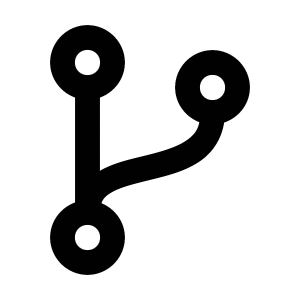

<div align="center">

# Forks Sync

Keep all your git forks up to date with the remote main branch.

[](https://github.com/Justintime50/forks-sync/actions)
[](https://coveralls.io/github/Justintime50/forks?branch=main)
[](https://pypi.org/project/forks-sync)
[](LICENSE)



</div>

If you manage more than a couple git forks, keeping them up to date with the remote main branch can be a pain. Forks Sync lets you avoid all the fuss by concurrently cloning each of your projects locally, adding the remote upstream, fetching upstream changes, rebasing them, and force pushing to your origin repo main branch - keeping all your forks up to date with the original repo.

By default, Forks Sync will save all your forks to `~/forks-sync` where you can also find logs for this tool.

**Note:** Before proceeding, know that this tool will forcefully update the main branch of your fork to match the upstream main branch.

## Install

```bash
# Install tool
pip3 install forks-sync

# Install locally
make install

# Get Makefile help
make help
```

## Usage

```bash
# Setup your ssh agent to ensure the script runs continually
ssh-add

# Pass your GitHub API key/token here:
GITHUB_TOKEN=123... forks-sync --branch my_main_branch

# Optional params:
# FORKS_SYNC_LOCATION="~/my-folder"
```

## Development

```bash
# Lint the project
make lint

# Run tests
make test

# Run test coverage
make coverage

# Run the tool locally
venv/bin/python forks/sync.py --help
```
